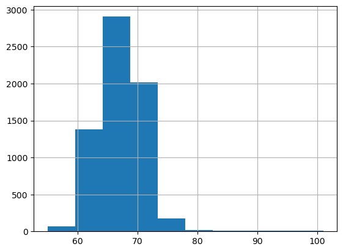
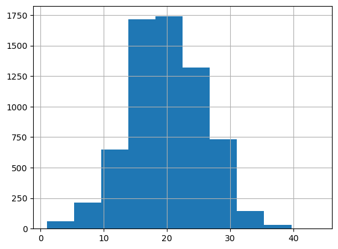
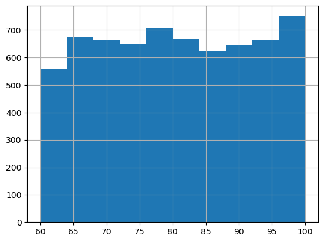
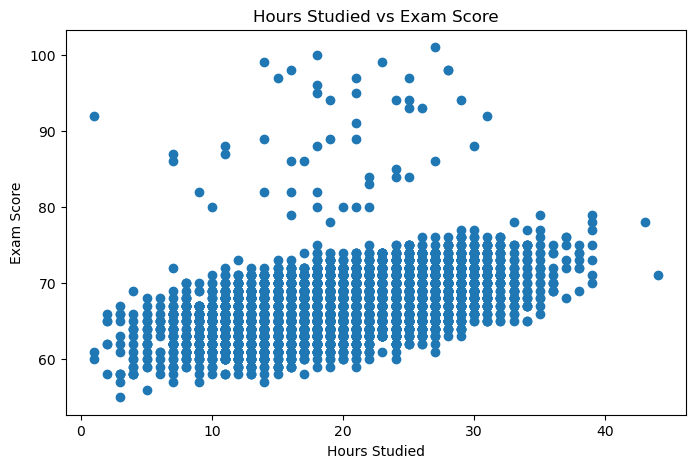
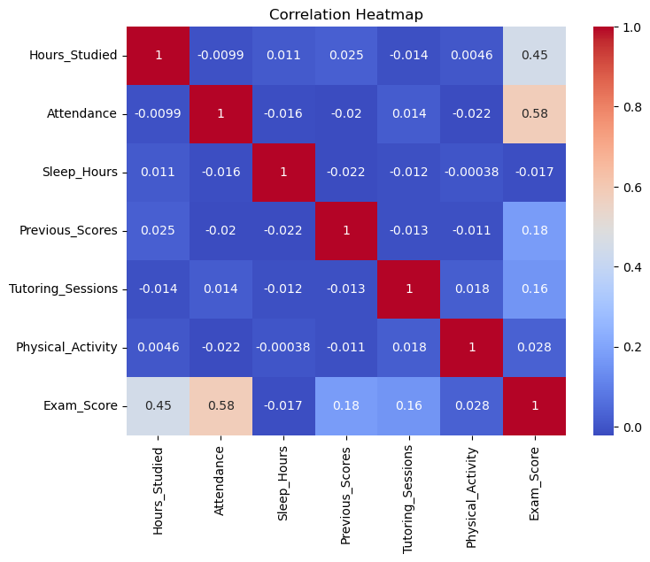
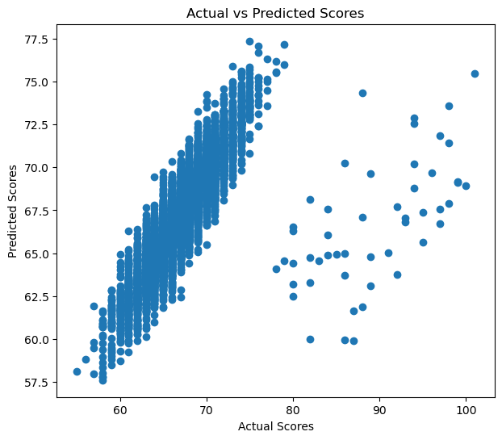

# Student Performance Analysis and Score Prediction

## Project Overview

This project investigates the factors influencing student examination performance using statistical analysis and machine learning techniques. The analysis combines exploratory data analysis (EDA), hypothesis testing, and linear regression modeling to identify significant academic and behavioral factors associated with examination scores.

The project follows a complete data analysis workflow, including data preprocessing, descriptive statistics, exploratory data analysis, inferential analysis, correlation analysis, predictive modeling, and model evaluation. The final regression model was assessed using performance metrics such as Mean Absolute Error (MAE), Root Mean Squared Error (RMSE), and R² Score.

## Project Objectives

The primary objectives of this project were to:

- Analyze the factors influencing students' examination performance.
- Perform descriptive and exploratory data analysis to identify patterns and trends.
- Examine relationships between academic variables using correlation analysis.
- Evaluate the statistical significance of selected variables through hypothesis testing.
- Develop and compare multiple linear regression models for predicting examination scores.
- Assess model performance using standard evaluation metrics including R² Score, MAE, RMSE, and residual analysis.

## Dataset

The dataset used in this project was obtained from **Kaggle** and contains information on various academic, behavioral, and environmental factors that may influence student examination performance.

| Attribute | Details |
|-----------|---------|
| Dataset Source | Kaggle |
| Number of Records | 6,607 |
| Target Variable | Exam Score |
| Analysis Language | Python |
| Development Environment | Jupyter Notebook |

The dataset includes both numerical and categorical variables, enabling the application of descriptive statistics, exploratory data analysis, hypothesis testing, correlation analysis, and predictive modeling.

## Technologies Used

| Category | Tools & Libraries |
|----------|-------------------|
| Programming Language | Python |
| Data Manipulation | Pandas, NumPy |
| Data Visualization | Matplotlib |
| Statistical Analysis | SciPy |
| Machine Learning | Scikit-learn |
| Development Environment | Jupyter Notebook |
| Version Control | Git & GitHub |

## Project Workflow

```text
Data Collection
       │
       ▼
Data Preprocessing
       │
       ▼
Descriptive Analysis
       │
       ▼
Exploratory Data Analysis
       │
       ▼
Correlation Analysis
       │
       ▼
Inferential Analysis
       │
       ▼
Regression Modeling
       │
       ▼
Model Evaluation
       │
       ▼
Key Findings & Conclusions
```
## Project Highlights

| Metric | Result |
|---------|--------|
| Dataset Size | 6,607 student records |
| Strongest Correlation | Attendance (r = 0.581) |
| Hours Studied Correlation | r = 0.445 |
| Best Regression Model | Multiple Linear Regression |
| Model Performance | R² = 0.598 |
| Statistical Tests | Pearson Correlation & ANOVA |

## Exploratory Data Analysis

### Distribution of Examination Scores



The examination scores are approximately normally distributed, with most students scoring between 60 and 80 marks. This indicates a balanced spread of academic performance with relatively few extreme scores.

---

### Distribution of Hours Studied



Most students studied between 15 and 25 hours, suggesting that moderate study durations were common across the dataset. Very few students reported extremely low or high study hours.

---

### Distribution of Attendance



Attendance is fairly evenly distributed across the dataset, providing a good representation of students with varying attendance levels for subsequent analysis.

## Relationship Analysis

### Hours Studied vs Examination Score



A moderate positive relationship exists between hours studied and examination scores (Pearson's correlation coefficient **r = 0.445**, *p* < 0.001). Students who studied for longer durations generally achieved higher examination scores, although study hours alone do not completely explain academic performance.

---

### Correlation Heatmap



The correlation heatmap summarizes the relationships among all numerical variables. Attendance and previous scores exhibit stronger positive associations with examination performance than most other predictors, supporting their inclusion in the predictive model.

## Model Performance

### Actual vs Predicted Examination Scores



The multiple linear regression model demonstrated good predictive performance, with predicted examination scores closely following the observed values. The final model achieved an **R² score of 0.598**, indicating that approximately **60% of the variation** in examination scores was explained by the selected predictor variables.

## Key Findings

- Attendance exhibited the strongest positive correlation with examination scores, highlighting the importance of regular class participation.
- Hours studied showed a moderate positive correlation (**r = 0.445**), indicating that increased study time generally contributes to better academic performance.
- ANOVA revealed statistically significant differences in examination scores across levels of **Access to Resources**, **Parental Involvement**, and **Motivation Level** (*p* < 0.001).
- The multiple linear regression model explained approximately **60%** of the variation in examination scores (**R² = 0.598**).
- The project demonstrates how statistical analysis and machine learning can be combined to identify meaningful predictors of student academic performance.

##  Repository Structure

```
Student-Performance-Analysis/
│
├── data/
│   └── StudentPerformanceFactors.csv
│
├── images/
│   ├── actual_vs_predicted_scores.png
│   ├── correlation_heatmap.png
│   ├── distribution_of_attendance.png
│   ├── distribution_of_examination_scores.png
│   ├── distribution_of_hours_studied.png
│   └── hours_studied_vs_examination_score.png
│
├── notebook/
│   └── student_performance_analysis.ipynb
│
├── report/
│   └── students_performance_project.docx
│
├── README.md
├── LICENSE
└── .gitignore
```

##  Getting Started

### Clone the repository

```bash
git clone https://github.com/priya-12ds/Student-Performance-Analysis.git
```

### Install the required libraries

```bash
pip install pandas numpy matplotlib scipy scikit-learn
```

### Launch Jupyter Notebook

```bash
jupyter notebook
```

Open the notebook and run the cells sequentially to reproduce the analysis and model results.

##  Future Improvements

- Explore additional machine learning algorithms such as Random Forest and XGBoost.
- Perform feature engineering to improve predictive performance.
- Develop an interactive dashboard using Streamlit or Power BI.
- Investigate feature importance using explainable AI techniques.
- Extend the analysis with cross-validation and hyperparameter tuning.

## About the Author

**Priyanshi**

Aspiring Data Scientist with an interest in statistical analysis, machine learning, and data visualization. This project was developed as part of my data science portfolio to demonstrate end-to-end data analysis, hypothesis testing, and predictive modeling using Python.

Feel free to connect with me on GitHub and explore my other projects.
